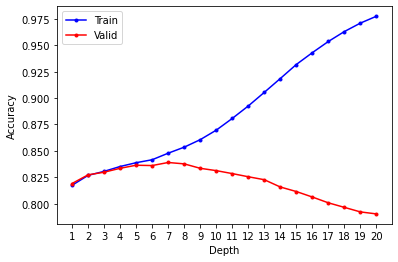
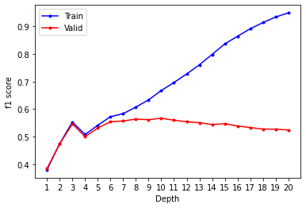
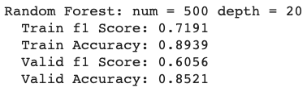

<!-- ---
export_on_save:
 html: true
--- -->

Cart Tree 和 Random Forest
---

目的：
- 二元分類問題：給予一天的各種特徵（氣溫、日照等）以及隔天是否下雨的標籤，希望訓練出根據天氣特徵，可以預測隔天天氣的分類器

成果：
- Cart Tree:
  - 隨著深度增加可以在訓練集中，無限提高準確度和f1 score
  - 深度過深，會導致Over-fitting，使得驗證集表現更差

  
  
  
- Random Forest:
  - 透過隨機抽取使用的樣本和特徵，使得森林中的樹互不相同，降低Variance
  - 嘗試不同的參數（樹的數量、建樹的深度、抽取樣本數等），並根據驗證集表現調整
  - 下圖為樹的數量 = 500、建樹的深度 = 20、抽取樣本數 = 20000時的表現：
    